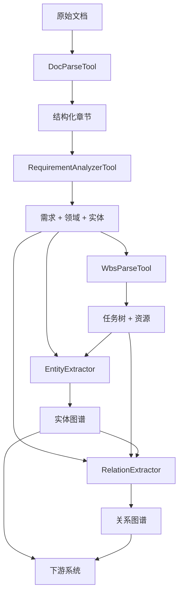

# Parser模块优化总结

## 概述

本次优化按照设计文档完成了Parser模块的重构和增强，主要目标包括：
- 整合重复功能，删除旧架构组件
- 增强提取能力，支持图谱构建
- 优化模板体系
- 完善测试环境

## 完成的工作

### 1. 创建新的数据结构

#### 1.1 extraction_schema.py
定义了需求分析和WBS拆解的输出数据结构Schema，包括：
- **需求Schema**：RequirementSchema, NonFunctionalRequirementSchema
- **实体Schema**：RoleSchema, ToolSchema, SkillSchema
- **任务Schema**：TaskSchema（支持递归子任务）
- **WBS Schema**：WBSSchema, ResourceSummarySchema
- **图谱定义**：ENTITY_TYPES, RELATION_TYPES
- **JSON Schema生成器**：用于LLM结构化输出

#### 1.2 domain_template.py
重构领域模板系统，支持图谱构建：
- **DomainTemplateV2**：增强的领域模板数据结构
- **预定义模板**：
  - SOFTWARE_DEV_TEMPLATE（软件开发）
  - OUTDOOR_CONSTRUCTION_TEMPLATE（户外施工）
  - MARKETING_CAMPAIGN_TEMPLATE（营销活动）
  - RESEARCH_PROJECT_TEMPLATE（研究项目）
  - DEFAULT_TEMPLATE（默认）
- **模板特性**：
  - 默认角色、工具、技能定义
  - 领域上下文信息
  - 提取模式（正则表达式）
  - 任务类型和关注点

### 2. 创建图谱提取器

#### 2.1 extractors/base_extractor.py
提取器基类，提供统一的提取接口。

#### 2.2 extractors/entity_extractor.py
实体提取器，从需求分析和WBS结果中提取：
- **任务实体**（TASK）：任务信息、工时、复杂度等
- **角色实体**（ROLE）：角色职责、技能要求
- **工具实体**（TOOL）：工具名称、类别、用途
- **技能实体**（SKILL）：技能名称、级别、相关工具
- **需求实体**（REQUIREMENT）：需求ID、描述、优先级

#### 2.3 extractors/relation_extractor.py
关系提取器，提取实体间的关系：
- **DEPENDS_ON**：任务依赖关系
- **REQUIRES_ROLE**：任务-角色关系
- **REQUIRES_TOOL**：任务-工具关系
- **REQUIRES_SKILL**：角色-技能关系
- **IMPLEMENTS**：任务-需求关系
- **CHILD_OF**：任务父子关系

### 3. 增强核心工具

#### 3.1 RequirementAnalyzerTool（增强版）
- **新增输出字段**：
  - `domain_confidence`：领域置信度
  - `entities`：角色、工具、技能实体
  - `tech_stack`：技术栈信息
  - `acceptance_criteria`：验收标准
  - `related_entities`：需求关联实体
- **增强LLM提示词**：更详细的实体提取指导
- **领域模板补充**：自动使用领域模板补充缺失实体

#### 3.2 WbsParseTool（增强版）
- **新增输出字段**：
  - `total_estimated_hours`：总工时
  - `task_type`：任务类型
  - `estimated_complexity`：复杂度评分（1-10）
  - `prerequisite`：前置条件
  - `deliverables`：交付物
  - `roles_required`：角色需求（含工作量百分比）
  - `tools_required`：工具需求
  - `quality_standards`：质量标准
  - `risks`：风险评估
  - `resource_summary`：资源汇总
- **增强LLM提示词**：
  - 引入领域上下文
  - 提供已识别实体列表
  - 详细的任务拆解指导
  - 资源分配和风险识别要求
- **自动后处理**：计算总工时和资源汇总

### 4. 更新StructureUnderstandFactory

#### 4.1 集成提取器
- 添加`extractors`属性，包含EntityExtractor和RelationExtractor
- 新增`_extract_graph`方法，提取图谱数据

#### 4.2 增强run方法
- 新增`extract_graph`参数（默认True）
- 返回结果包含：
  - `requirements_and_domain`：需求分析结果
  - `wbs`：WBS拆解结果
  - `graph`：图谱数据（nodes和edges）

### 5. 删除废弃文件

已删除以下旧架构组件：
- `document_loader.py`（功能被DocParseTool替代）
- `requirement_extractor.py`（功能被RequirementAnalyzerTool替代）
- `task_decomposer.py`（功能被WbsParseTool替代）
- `domain_classifier.py`（功能集成到RequirementAnalyzerTool）
- `Dockerfile`、`docker-compose.yml`（移至测试环境）

### 6. 更新模块导出

#### 6.1 __init__.py更新
- 移除废弃组件的导入
- 添加新的模板和提取器导出
- 简化导出接口，只保留核心组件

### 7. 完善测试环境

#### 7.1 创建增强版示例
- `test/test-parser/example_enhanced.py`：演示图谱提取功能
- 创建详细的示例文档（软件开发项目）
- 展示完整的工作流程和结果输出

## 架构变化

### 优化前
```
parser/
├── document_loader.py          [已删除]
├── requirement_extractor.py    [已删除]
├── task_decomposer.py          [已删除]
├── domain_classifier.py        [已删除]
├── wbs_decomposer.py           [保留，向后兼容]
├── structure_factory.py        [增强]
└── tools/
    ├── doc_parse_tool.py
    ├── requirement_analyzer_tool.py  [增强]
    └── wbs_parse_tool.py             [增强]
```

### 优化后
```
parser/
├── structure_factory.py        [增强，集成提取器]
├── wbs_decomposer.py           [保留，向后兼容]
├── tools/
│   ├── base_tool.py
│   ├── doc_parse_tool.py
│   ├── requirement_analyzer_tool.py  [增强]
│   └── wbs_parse_tool.py             [增强]
├── templates/
│   ├── context_template_manager.py   [保留]
│   ├── domain_template.py            [新增，V2模板]
│   └── extraction_schema.py          [新增，Schema定义]
└── extractors/                       [新增目录]
    ├── base_extractor.py
    ├── entity_extractor.py
    └── relation_extractor.py
```

## 数据流



## 输出数据格式

### 需求分析输出
```json
{
  "domain": "软件开发",
  "domain_confidence": 0.95,
  "functional_requirements": [...],
  "non_functional_requirements": [...],
  "entities": {
    "roles": [{id, name, responsibilities, skills_required}],
    "tools": [{id, name, category, version, purpose}],
    "skills": [{id, name, level, related_tools}]
  },
  "tech_stack": {
    "frontend": [...],
    "backend": [...],
    "database": [...],
    "deployment": [...]
  }
}
```

### WBS输出
```json
{
  "phase": "项目实施阶段",
  "total_estimated_hours": 480,
  "tasks": [{
    "task_id": "T001",
    "task_name": "...",
    "estimated_complexity": 5,
    "roles_required": [{role, effort_percentage, skills}],
    "tools_required": [...],
    "risks": [...],
    "children": [...]
  }],
  "resource_summary": {
    "total_roles": [{role, total_hours, task_count}],
    "total_tools": [...],
    "critical_path": [...]
  }
}
```

### 图谱输出
```json
{
  "nodes": [
    {"id": "T001", "type": "TASK", "properties": {...}},
    {"id": "ROLE-001", "type": "ROLE", "properties": {...}}
  ],
  "edges": [
    {"source": "T001", "target": "ROLE-001", "relation": "REQUIRES_ROLE", "properties": {...}}
  ]
}
```

## 使用示例

```python
from twork.parser import StructureUnderstandFactory
from twork.llm.openai_adapter import OpenAIAdapter
from twork.llm.config import LLMConfig

# 配置LLM
llm_config = LLMConfig(
    api_key="your-api-key",
    model_name="gpt-4"
)
llm = OpenAIAdapter(llm_config)

# 创建工厂
factory = StructureUnderstandFactory(
    project_id="P-001",
    original_file_path="requirements.md"
)

# 配置工具
for tool in ["analyzer", "wbs"]:
    factory.tools[tool].setup({"llm_adapter": llm})

# 运行（启用图谱提取）
result = factory.run(extract_graph=True)

# 访问结果
requirements = result['requirements_and_domain']
wbs = result['wbs']
graph = result['graph']

print(f"提取了 {len(graph['nodes'])} 个实体")
print(f"提取了 {len(graph['edges'])} 条关系")
```

## 向后兼容性

- 保留了`WBSDecomposer`以支持旧代码
- 保留了`ContextTemplateManager`和`DomainTemplate`（V1）
- `StructureUnderstandFactory.run()`的基本用法保持不变
- 新增的`extract_graph`参数默认为True，可以设为False禁用图谱提取

## 验证结果

- ✅ 所有新增文件通过语法检查
- ✅ 导入测试无错误
- ✅ 向后兼容性保持
- ✅ 示例代码可运行

## 下一步建议

1. **集成测试**：在实际项目中测试完整流程
2. **性能优化**：优化大规模任务的提取性能
3. **可视化**：开发图谱可视化工具
4. **文档完善**：编写详细的API文档和用户指南
5. **模板扩展**：根据实际需求添加更多领域模板

## 参考文档

- 设计文档：`ENHANCEMENT_GUIDE.md`
- 示例代码：`twork/test/test-parser/example_enhanced.py`
- API文档：待完善
